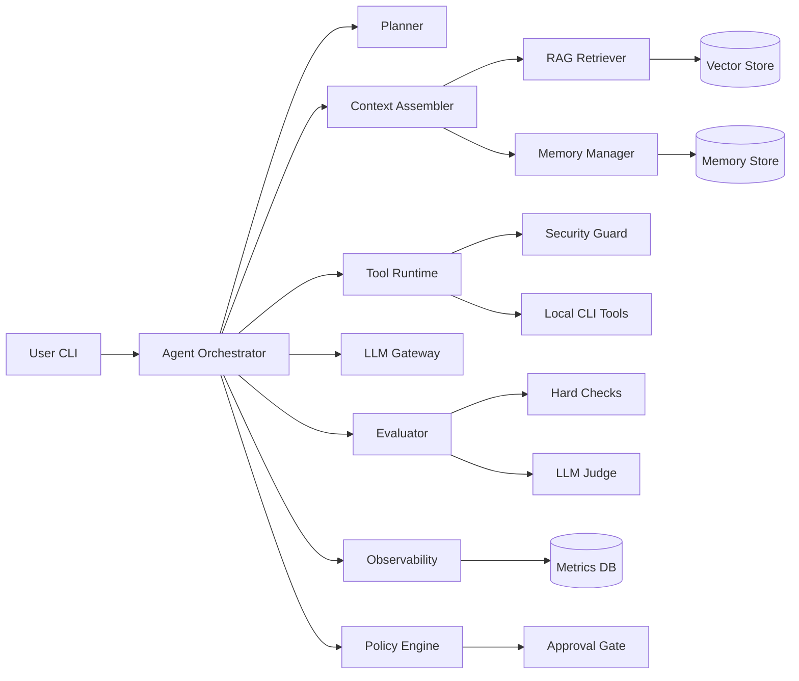
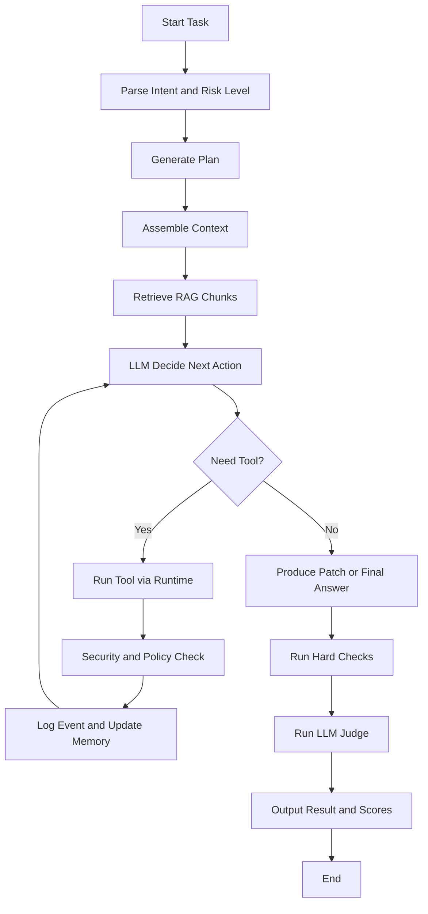
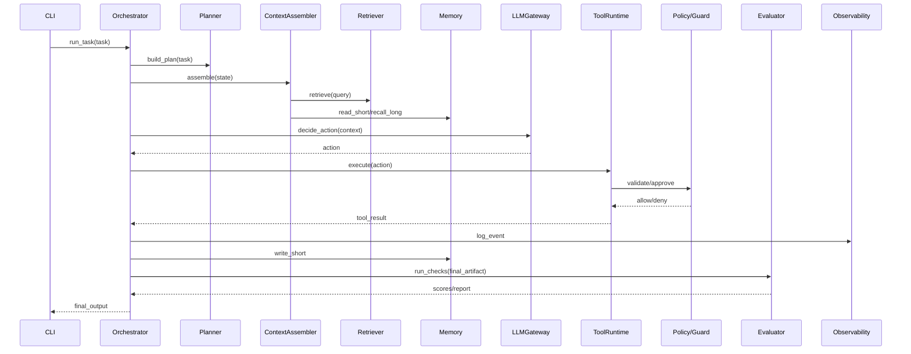

# AI 编程助手项目设计说明书（可落地开发版）

## 1. 文档目标

### 1.1 项目定位
- 项目名称：CodePilot Lite（本地代码仓库 AI 编程助手）
- 目标：实现“读代码 -> 改代码 -> 跑测试 -> 评估反馈”的完整闭环
- 使用场景：实习项目、面试展示、后续工程扩展

### 1.2 设计原则
- 先可用：优先跑通端到端最小闭环
- 再可测：建立硬性与语义双轨评估
- 再可控：引入约束、治理、审批、审计
- 再可扩：预留多模型、多 Agent、MCP 适配空间

### 1.3 首版边界（MVP）
- 单 Agent
- Python 原生编排
- CLI 工具调用（不强依赖 MCP）
- 代码库 RAG
- 短期 + 轻量长期记忆
- 硬性评估 + LLM 评审
- 基础治理闭环（观测、纠偏、收敛）

---

## 2. 总体架构

### 2.1 逻辑架构图



### 2.2 架构说明
- Agent Orchestrator 是编排核心，负责任务状态与循环推进。
- Context Assembler 负责上下文预算与信息拼装（计划、记忆、检索片段）。
- Tool Runtime 统一执行工具，所有调用先过 Security Guard 与 Policy Engine。
- Evaluator 同时执行硬校验和 LLM 语义评审。
- Observability 负责全链路事件记录与指标产出，支撑治理收敛。

---

## 3. 核心流程

### 3.1 单任务执行流程图



### 3.2 执行步骤说明
1. 解析任务意图并做风险分级。
2. 生成计划并初始化状态机。
3. 组装上下文（计划、短期记忆、长期记忆、RAG 片段）。
4. 模型决策下一步动作（调用工具或直接输出）。
5. 工具调用通过安全守卫执行并回写观察。
6. 循环迭代直到满足停止条件。
7. 执行评估并产出结果报告。

---

## 4. 模块划分与职责

### 4.1 app 层
- CLI 入口与参数解析
- 任务启动、回放、评估命令路由

### 4.2 core 层
- Orchestrator：主循环、异常恢复、终止策略
- Planner：任务拆解与计划更新
- Context Assembler：上下文裁剪与注入策略
- State Machine：任务状态迁移

### 4.3 models 层
- LLM Gateway：统一模型调用接口
- Prompt Builder：系统/任务/工具反馈提示模板
- Schema Validator：结构化输出校验

### 4.4 tools 层
- Tool Registry：工具声明与注册
- Tool Runtime：统一执行、重试、超时、错误标准化
- Builtin Tools：文件读写、代码搜索、补丁应用、测试运行、diff

### 4.5 rag 层
- Indexer：离线切块、向量化、入库
- Retriever：关键词 + 向量混合检索
- Reranker：重排候选片段
- Budget Manager：控制注入上下文长度

### 4.6 memory 层
- Short Memory：会话级任务记忆
- Long Memory：跨任务经验记忆
- Summarizer：轮次压缩与里程碑摘要

### 4.7 eval 层
- Hard Eval：测试、lint、约束命中
- LLM Eval：语义质量评分
- Scorer：加权聚合与阈值判定
- Reporter：评估报告输出

### 4.8 governance 层
- Policy Engine：规则与风险策略
- Guards：路径、命令、权限守卫
- Approval Gate：高风险动作审批
- Convergence：治理收敛控制

### 4.9 observability 层
- 结构化日志
- 指标采集
- 链路追踪与回放

---

## 5. 技术选型文档

### 5.1 语言与运行时
- Python 3.11
- 原因：生态成熟、AI SDK 完整、开发效率高

### 5.2 核心框架与库
- CLI：Typer
- 数据模型：Pydantic
- 配置：pydantic-settings
- 数据库：SQLAlchemy + SQLite（首版）
- 日志：structlog
- 测试：pytest

### 5.3 RAG 相关
- 向量库：faiss-cpu（首选）或 chromadb
- Embedding：sentence-transformers
- 关键词召回：rank-bm25

### 5.4 模型层
- 执行模型：代码能力强、工具调用稳定的主模型
- 评审模型：成本更低、稳定性高的评估模型
- 原则：执行与评审模型分离，降低自评偏差

### 5.5 可选中间件（后续扩展）
- 异步任务：Redis + Celery
- 监控看板：Prometheus + Grafana

---

## 6. 第三方依赖 / 模型 / 中间件说明

### 6.1 必需依赖（MVP）
- typer
- pydantic
- pydantic-settings
- sqlalchemy
- pytest
- structlog
- rich
- python-dotenv

### 6.2 RAG 依赖
- faiss-cpu 或 chromadb
- sentence-transformers
- rank-bm25
- numpy

### 6.3 模型 SDK 依赖
- openai 或 anthropic（按供应商选择）
- litellm（可选，用于统一适配）

### 6.4 中间件依赖策略
- MVP 不强依赖额外中间件
- 并行扩展阶段引入 Redis/Celery

---

## 7. 代码目录结构

```text
codepilot-lite/
  README.md
  pyproject.toml
  .env.example
  Makefile

  configs/
    app.yaml
    model.yaml
    tools.yaml
    eval.yaml
    policy.yaml

  data/
    rag/
      chunks/
      index/
    memory/
      short/
      long/
    eval/
      datasets/
      reports/

  src/
    app/
      cli.py
      bootstrap.py

    core/
      orchestrator.py
      planner.py
      context_assembler.py
      state_machine.py
      stop_rules.py

    models/
      llm_gateway.py
      prompt_builder.py
      output_schema.py

    tools/
      registry.py
      runtime.py
      contracts.py
      builtin/
        read_file.py
        search_code.py
        write_file.py
        apply_patch.py
        run_tests.py
        git_diff.py
        list_dir.py

    rag/
      indexer.py
      retriever.py
      reranker.py
      chunker.py
      vector_store.py

    memory/
      short_memory.py
      long_memory.py
      summarizer.py
      store.py

    eval/
      hard_eval.py
      llm_eval.py
      scorer.py
      runner.py
      report.py

    governance/
      policy_engine.py
      guards.py
      approval_gate.py
      convergence.py

    observability/
      logger.py
      metrics.py
      tracer.py
      replay.py

    infra/
      db.py
      config.py

  tests/
    unit/
    integration/
    eval/

  scripts/
    build_index.py
    run_eval.py
    compare_runs.py
```

---

## 8. 工具 / 函数 / 类设计说明

### 8.1 核心类

#### AgentOrchestrator
- run_task(task_input) -> TaskResult
- loop_step(state) -> State
- decide_next_action(context) -> Action
- handle_tool_result(action, result) -> State

#### Planner
- build_plan(task_input) -> Plan
- update_plan(plan, observation) -> Plan
- current_step(plan) -> Step

#### ContextAssembler
- assemble(state, rag_chunks, memories) -> PromptContext
- enforce_budget(context, token_budget) -> PromptContext

#### ToolRegistry
- register(tool_spec)
- get(tool_name)
- validate(tool_name, args)

#### ToolRuntime
- execute(tool_name, args) -> ToolResult
- execute_with_retry(tool_name, args, policy) -> ToolResult

#### RAGIndexer
- build_index(repo_path)
- upsert_documents(docs)

#### RAGRetriever
- retrieve(query, top_k) -> list[Chunk]
- hybrid_retrieve(query, k_sparse, k_dense) -> list[Chunk]
- rerank(chunks, query) -> list[Chunk]

#### MemoryManager
- read_short(session_id)
- write_short(session_id, event)
- recall_long(query, top_k)
- write_long(item)

#### Evaluator
- run_hard_checks(task_artifact) -> HardScore
- run_llm_judge(task_context) -> JudgeScore
- aggregate_scores(hard, judge) -> TotalScore

#### PolicyEngine
- classify_risk(task, action) -> RiskLevel
- should_require_approval(risk, action) -> bool
- apply_constraints(action) -> Action

---

## 9. 内部调用关系

### 9.1 主调用链
1. CLI -> AgentOrchestrator.run_task
2. Orchestrator -> Planner.build_plan
3. Orchestrator -> ContextAssembler.assemble
4. ContextAssembler -> RAGRetriever.retrieve
5. ContextAssembler -> MemoryManager.read_short / recall_long
6. Orchestrator -> LLMGateway.generate_action
7. Orchestrator -> ToolRuntime.execute_with_retry（如需工具）
8. ToolRuntime -> PolicyEngine / Guards
9. ToolRuntime -> Builtin Tool
10. 结果回写 MemoryManager + Observability
11. 任务结束 -> Evaluator.run_hard_checks + run_llm_judge
12. Reporter 输出评估报告

### 9.2 调用关系图（简化）



---

## 10. RAG 设计

### 10.1 作用
- 不只是读取本地代码，而是按需检索任务相关上下文（代码 + 文档 + 规范）。

### 10.2 数据处理
- 代码按函数/类切块
- 文档按标题段落切块
- 元数据包含：路径、符号、起止行、更新时间

### 10.3 检索策略
1. 关键词召回（高精度）
2. 向量召回（高语义覆盖）
3. 重排（可选）
4. top-k 注入（受 token 预算控制）

---

## 11. 记忆系统设计

### 11.1 短期记忆（必须）
- 保存当前任务目标、计划进度、最近观察、失败原因
- 每 N 轮摘要压缩，避免上下文膨胀

### 11.2 长期记忆（轻量）
- 存储跨任务经验：项目约定、偏好、常见修复策略、失败反模式
- 支持标签与过期清理

### 11.3 写入与读取策略
- 写入：关键里程碑、失败复盘、稳定有效策略
- 读取：任务开始 + 关键决策前召回 top-k 条

---

## 12. 评估系统设计

### 12.1 目标
- 建立可量化、可复现、可对比的评估闭环

### 12.2 硬性评估（主）
- 测试通过率
- lint/type check 通过率
- 目标文件命中
- 约束满足（例如不越界修改）

### 12.3 LLM 评估（辅）
- 需求覆盖度
- 代码可读性
- 风险识别完整性
- 解释质量

### 12.4 指标建议
- 北极星：任务成功率 TSR
- 一次通过率 OTR
- 平均耗时 MTTR
- 成本（token / API）
- 无效工具调用率

---

## 13. 系统性约束与治理

### 13.1 约束层
- 路径沙箱限制
- 危险命令拦截
- 参数模式校验
- 高风险操作审批

### 13.2 持续观测
- 全链路事件日志
- 指标看板（成功率、成本、失败分类、拦截率）
- 周期趋势与漂移监控

### 13.3 纠偏机制
- 在线纠偏：失败分类后策略化重试
- 离线纠偏：周期复盘，更新提示词和参数

### 13.4 收敛机制
- 设定稳定阈值（例如连续两周成功率 > 65%）
- 版本门禁（关键指标劣化则禁止发布）

---

## 14. 非功能性要求

### 14.1 可靠性
- 工具超时控制
- 幂等执行与可恢复状态

### 14.2 安全性
- 默认最小权限
- 审批门控制敏感操作

### 14.3 可维护性
- 模块边界清晰
- 核心路径可测试可回放

### 14.4 可扩展性
- 预留多模型路由
- 预留子代理与 MCP 适配接口

---

## 15. 里程碑与交付物（8 周）

### M1（第 1-2 周）
- 交付：CLI、主循环、基础工具闭环

### M2（第 3-4 周）
- 交付：补丁 + 测试验证 + 短期记忆

### M3（第 5-6 周）
- 交付：RAG + 长期记忆 + 基础治理

### M4（第 7-8 周）
- 交付：评估系统 + 指标看板 + 收敛策略

---

## 16. 最小验收标准（DoD）

1. 能稳定完成 20 条标准任务并输出可追踪结果。
2. 关键指标可自动统计并生成报告。
3. 高风险操作可被拦截或进入审批流程。
4. 每次版本迭代可执行回归评估并对比基线。

---

## 17. 附录：首版建议命令

```bash
# 安装依赖
pip install -e .

# 构建索引
python scripts/build_index.py --repo /path/to/repo

# 执行任务
python -m src.app.cli run --task "fix failing tests in module X"

# 运行评估
python scripts/run_eval.py --dataset data/eval/datasets/tasks.jsonl

# 比较版本结果
python scripts/compare_runs.py --run-a run_001 --run-b run_002
```
